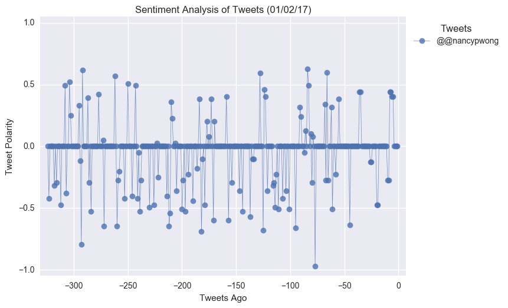
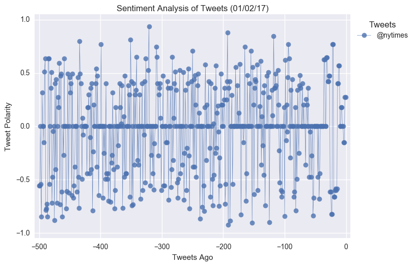

# Social API Analytics

## Background

**Twitter** has become a wildly sprawling jungle of information—140 characters at a time. Somewhere between 350 million and 500 million tweets are estimated to be sent out _per day_. With such an explosion of data, on Twitter and elsewhere, it becomes more important than ever to tame it in some way, to concisely capture the essence of the data.

## Project1: Media Sentiment Analysis

In this project, I created a Python script to perform a sentiment analysis of the Twitter activity of various news outlets, and presented visualized summary of the sentiments analysis for the following news organizations: **BBC, CBS, CNN, Fox, and New York times**.

Libraries used: tweepy, pandas, numpy, matplotlib, json,time and VADER.

## Project2: PlotBot

In this project,I built a Twitter bot that sends out visualized sentiment analysis of a Twitter account's recent tweets.

The bot receives tweets via mentions and in turn performs sentiment analysis on the most recent twitter account specified in the mention

For example, when a user tweets, **"@PlotBot Analyze: @CNN,"** it will trigger a sentiment analysis on the CNN twitter feed.

A plot from the sentiment analysis is then tweeted to the PlotBot5 twitter feed. See below for examples of scatter plots you will generate:

Features of PlotBot:

* Scan your account every **five minutes** for mentions.
* Pull 500 most recent tweets to analyze for each incoming request.
* Prevent abuse by analyzing **only** Twitter accounts that have not previously been analyzed.
* Mention the Twitter account name of the requesting user.

