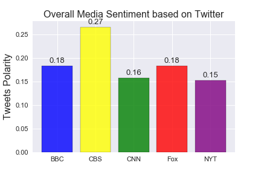

# Social API Analytics

## Background

**Twitter** has become a wildly sprawling jungle of information—140 characters at a time. Somewhere between 350 million and 500 million tweets are estimated to be sent out _per day_. With such an explosion of data, on Twitter and elsewhere, it becomes more important to concisely capture the essence of the data.

## Project1: Media Sentiment Analysis

In this project, I created a Python script to perform a sentiment analysis of the Twitter activity of various news outlets, and presented visualized summary of the sentiments analysis for the following news organizations: **BBC, CBS, CNN, Fox, and New York times**.

Libraries used: tweepy, pandas, numpy, matplotlib, json,time and VADER.

```python
# Creating a dataframe from the Sentiment Array
Sentiment_DF=pd.DataFrame.from_dict(Sentiment_array)
# Removing the '@' from Media column in the data frame
Sentiment_DF['Media'] = Sentiment_DF['Media'].map(lambda x: x.lstrip('@'))

# Re_arranging the order of columns before saving into CSV file
Sentiment_DF=Sentiment_DF[["Media","Date","Tweet Text","Compound","Positive","Negative","Neutral","Tweets Ago"]]
# Storing into a CSV File\
Sentiment_DF.to_csv("Output/Media_SentimentAnalysis.csv")

Sentiment_DF.head()
```
<div>
<table border="1" class="dataframe">
  <thead>
    <tr style="text-align: right;">
      <th></th>
      <th>Media</th>
      <th>Date</th>
      <th>Tweet Text</th>
      <th>Compound</th>
      <th>Positive</th>
      <th>Negative</th>
      <th>Neutral</th>
      <th>Tweets Ago</th>
    </tr>
  </thead>
  <tbody>
    <tr>
      <th>0</th>
      <td>BBC</td>
      <td>Fri Jan 05 15:27:42 +0000 2018</td>
      <td>RT @BBCOne: So, what exactly is #HardSun? 🤔 We...</td>
      <td>0.0000</td>
      <td>0.000</td>
      <td>0.000</td>
      <td>1.000</td>
      <td>100</td>
    </tr>
    <tr>
      <th>1</th>
      <td>BBC</td>
      <td>Fri Jan 05 14:33:07 +0000 2018</td>
      <td>☕️ An estimated 2.5 billion disposable coffee ...</td>
      <td>0.0000</td>
      <td>0.000</td>
      <td>0.000</td>
      <td>1.000</td>
      <td>99</td>
    </tr>
    <tr>
      <th>2</th>
      <td>BBC</td>
      <td>Fri Jan 05 14:23:24 +0000 2018</td>
      <td>RT @bbcthree: In 2012, Naomi was the victim of...</td>
      <td>-0.2732</td>
      <td>0.118</td>
      <td>0.198</td>
      <td>0.684</td>
      <td>98</td>
    </tr>
    <tr>
      <th>3</th>
      <td>BBC</td>
      <td>Fri Jan 05 14:00:06 +0000 2018</td>
      <td>How do you keep your New Year's resolution to ...</td>
      <td>0.4939</td>
      <td>0.176</td>
      <td>0.000</td>
      <td>0.824</td>
      <td>97</td>
    </tr>
    <tr>
      <th>4</th>
      <td>BBC</td>
      <td>Fri Jan 05 13:33:12 +0000 2018</td>
      <td>Here's how the weather has looked around the w...</td>
      <td>0.0000</td>
      <td>0.000</td>
      <td>0.000</td>
      <td>1.000</td>
      <td>96</td>
    </tr>
  </tbody>
</table>
</div>




## Project2: PlotBot

In this project,I built a Twitter bot that sends out visualized sentiment analysis of a Twitter account's recent tweets.

The bot receives tweets via mentions and in turn performs sentiment analysis on the most recent twitter account specified in the mention

For example, when a user tweets, **"@PlotBot Analyze: @CNN,"** it will trigger a sentiment analysis on the CNN twitter feed.

A plot from the sentiment analysis is then tweeted to the PlotBot5 twitter feed. See below for examples of scatter plots you will generate:


Features of PlotBot:

* Scan your account every **five minutes** for mentions.
* Pull 500 most recent tweets to analyze for each incoming request.
* Prevent abuse by analyzing **only** Twitter accounts that have not previously been analyzed.
* Mention the Twitter account name of the requesting user.
